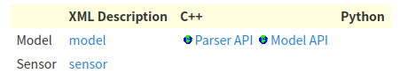
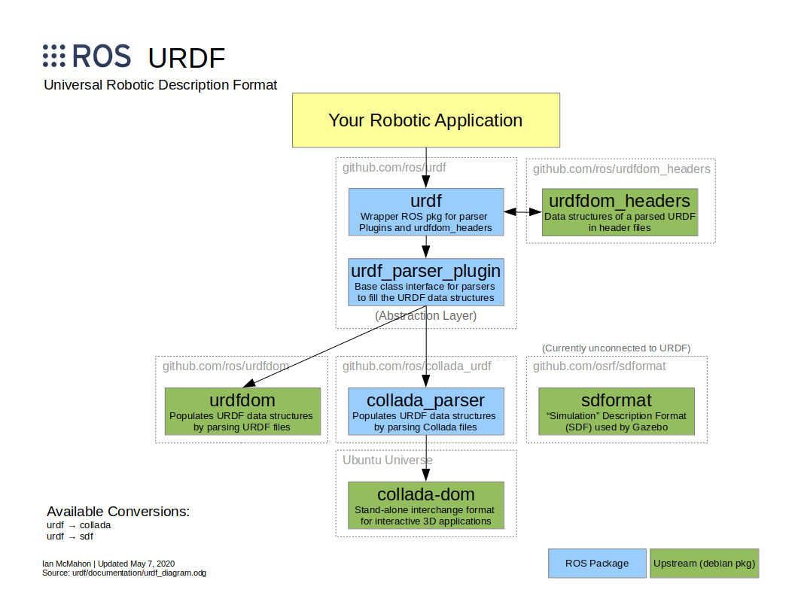
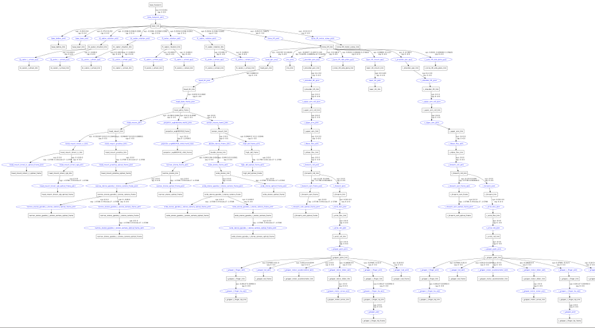

# URDF


## 概述

urdf 功能包包含了机器人模型、传感器、场景等的大量 XML 规范。每个 XML 规范都有一种或多种语言的相应解析器。



- [model](https://wiki.ros.org/urdf/XML/model)
- [sensor](https://wiki.ros.org/urdf/XML/sensor)
- [Parser API](www.ros.org/doc/api/urdf/html/)
- [Model API](https://github.com/ros/urdfdom_headers/tree/master/urdf_model/include/urdf_model)


## 组件




## 快速入门

[urdf-tutorials](https://wiki.ros.org/urdf/Tutorials/)

[xacro](https://wiki.ros.org/xacro?distro=melodic) 用于描述机器人的宏语言，以便于维护机器人描述文件，提高其可读性，并避免机器人描述文件中的重复。


## 例程

一些描述机器人的 URDF 模型例子 [Click here](https://wiki.ros.org/urdf/Examples)


## 工具

### 验证（Verification）

命令行工具 check_urdf 尝试将文件解析为urdf描述，并打印结果运动链的描述或错误消息。

xacro 描述文件转 urdf 描述文件

```
rosrun xacro xacro.py path/target.xacro -o path/target.urdf

rosrun xacro xacro.py `rospack find pr2_description`/robots/pr2.urdf.xacro -o /tmp/pr2.urdf
```


dependents

```
sudo apt-get install liburdfdom-tools
```


check_urdf

```
check_urdf pr2.urdf
rosrun urdfdom check_urdf pr2.urdf
```

command line 输出

```
robot name is: pr2
---------- Successfully Parsed XML ---------------
root Link: base_footprint has 1 child(ren)
    child(1):  base_link
        child(1):  base_laser_link
        child(2):  bl_caster_rotation_link
            child(1):  bl_caster_l_wheel_link
            child(2):  bl_caster_r_wheel_link
        child(3):  br_caster_rotation_link
            child(1):  br_caster_l_wheel_link
            child(2):  br_caster_r_wheel_link
        child(4):  fl_caster_rotation_link
            child(1):  fl_caster_l_wheel_link
            child(2):  fl_caster_r_wheel_link
        child(5):  fr_caster_rotation_link
            child(1):  fr_caster_l_wheel_link
            child(2):  fr_caster_r_wheel_link
        child(6):  torso_lift_link
            child(1):  head_pan_link
                child(1):  head_tilt_link
                    child(1):  head_plate_frame
                        child(1):  sensor_mount_link
                            child(1):  double_stereo_link
                                child(1):  narrow_stereo_link
 ...
```


### 可视化（Visualization）

获取 urdf 描述文件的可视化图形视图（graphviz diagram）

```
urdf_to_graphiz pr2.urdf
```





## Reference

[urdf ros wiki](https://wiki.ros.org/urdf)

[urdf-Tutorials](https://wiki.ros.org/urdf/Tutorials)

[TF2 ros wiki](https://wiki.ros.org/tf2)

[urdf-xml-ros-wiki](https://wiki.ros.org/urdf/XML)

[xacro-ros-wiki](https://wiki.ros.org/xacro?distro=melodic)