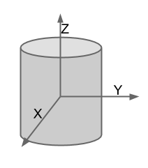
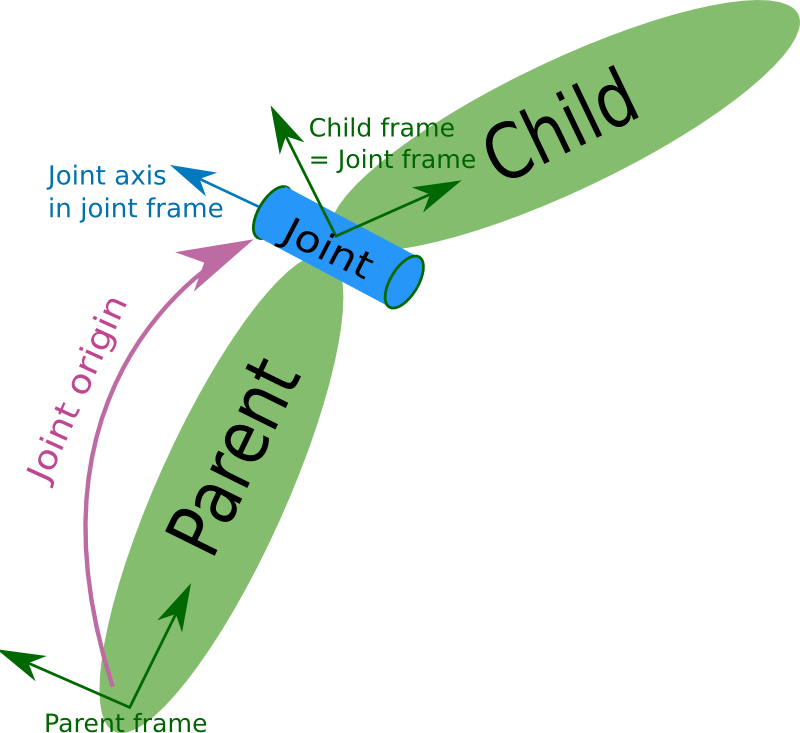

# URDF-XML


## robot

robot-描述机器人的所有属性

robot描述文件中的根元素必须是robot，所有其他元素都必须封装在其中。


### 元素（Elements）

[\<link\>](https://wiki.ros.org/urdf/XML/link) 

- defines a link with its own frame 

[\<joint\>](https://wiki.ros.org/urdf/XML/joint) 

- mandatory joint frame definition 

[\<transmission\>](https://wiki.ros.org/urdf/XML/Transmission) 

- (PR2 specific) 

[\<gazebo\>](https://wiki.ros.org/urdf/XML/Gazebo) 

- [Gazebo](https://wiki.ros.org/gazebo_ros_pkgs) simulation extensions 


### 属性（Attributes）

name

主文件必须具有名称属性。在包含的文件中，“名称”属性是可选的。如果在其他包含的文件中指定了属性名称，则该属性名称的值必须与主文件中的值相同。


### Example

```
<robot name="pr2">
  <!-- pr2 robot links and joints and more -->
</robot>
```


## sensor/proposals

sensor/proposals-描述传感器，如摄像头、激光传感器等

这是为传感器元件添加新型传感器的 proposals


### 属性（Attributes）

**name** *(required) (string)* 

- The name of the sensor itself 

**type** *(required) (string)* 

- The type of the sensor as camera, ray, imu, magnetometer, gps, force_torque, contact, sonar, rfidtag, rfid 

**id** *(optional) (string)* 

- The id of the sensor, it's used for describing order of sensors, and so on. 

**update_rate** *(optional) (float) (Hz)* 

- The frequency at which the sensor data is generated. If left unspecified, the sensor will generate data every cycle.


### 元素（Elements）

**<parent>** *(required)* 

- **link** *(required) (string)* 
  - The name of the link this sensor is attached to. 

**<origin>** *(optional: defaults to identity if not specified)* 

- This is the pose of the sensor optical frame, relative to the sensor parent reference frame.  The sensor optical frame adopts the conventions of z-forward, x-right and y-down. 

- **xyz** *(optional: defaults to zero vector)* 

  - Represents the 

    ```
    latex error! exitcode was 2 (signal 0), transscript follows:
    
    [Wed Jun 15 11:06:28.457406 2022] [:error] [pid 6948] failed to exec() latex
    ```

     offset. 

    

- **rpy** *(optional: defaults to identity if not specified)* 

  - Represents the fixed axis roll, pitch and yaw angles in radians. 

**<gazebo>** *(optional)* 

- This element may be ignored by ROS. 

**<camera>** *(optional)* 

- **<image>** *(required)* 
  - **width** *(required) (unsigned int) (pixels)* 
    - Width of the camera in pixels. 
  - **height** *(required) (unsigned int) (pixels)* 
    - Height of the camera in pixels. 
  - **format** *(required) (string)* 
    - Image format of the camera.  Can be any of the strings defined in [image_encodings.h insdie sensor_msgs](https://code.ros.org/trac/ros-pkg/browser/stacks/common_msgs/trunk/sensor_msgs/include/sensor_msgs/image_encodings.h). 
  - **hfov** *(required) (float) (radians)* 
    - Horizontal field of view of the camera 
  - **near** *(required) (float) (m)* 
    - Near clip distance of the camera in meters. 
  - **far** *(required) (float) (m)* 
    - Far clip distance of the camera in meters.  This needs to be greater or equal to near clip. 

**<ray>** *(optional)* 

- **<horizontal>** *(optional)* 
  - **samples** *(optional: default 1) (unsigned int)* 
    - The number of simulated rays to generate per complete laser sweep cycle. 
  - **resolution** *(optional: default 1) (float)* 
    - This number is multiplied by samples to determine the number of range data  points returned. If resolution is less than one, range data is  interpolated. If resolution is greater than one, range data is averaged. 
  - **min_angle** *(optional: default 0) (float) (radians)* 
  - **max_angle** *(optional: default 0) (float) (radians)* 
    - Must be greater or equal to min_angle 
- **<vertical>** *(optional)* 
  - **samples** *(optional: default 1) (unsigned int)* 
    - The number of simulated rays to generate per complete laser sweep cycle. 
  - **resolution** *(optional: default 1) (float)* 
    - This number is multiplied by samples to determine the number of range data  points returned. If resolution is less than one, range data is  interpolated. If resolution is greater than one, range data is averaged. 
  - **min_angle** *(optional: default 0) (float) (radians)* 
  - **max_angle** *(optional: default 0) (float) (radians)* 
    - Must be greater or equal to min_angle 
- **<range>** *(optional)* 
  - **min** *(optional: default 0) (float)* 
  - **max** *(optional: default finite) (float)* 
  - **resolution** *(optional) (float)* 

**<imu>** *(optional)* 

- **<gyro>** *(optional)* 
  - **<noise>** *(optional)* 
    - Noise parameter should be as same as the definition of SDF. 
- **<acceleration>** *(optional)* 
  - **<noise>** *(optional)* 

**<magnetometer>** *(optional)* 

- **<noise>** *(optional)* 

**<gps>** *(optional)* 

- **<position_sensing>** *(optional)* 
  - **<noise>** *(optional)* 
- **<velocity_sensing>** *(optional)* 
  - **<noise>** *(optional)* 

**<force_torque>** *(optional)* 

- **<frame>** *(optional)* 
- **<measure_direction>** *(optional)* 
  - Direction of the wrench measured by the sensor. The supported options are:  "parent_to_child" if the measured wrench is the one applied by parent  link on the child link, "child_to_parent" if the measured wrench is the  one applied by the child link on the parent link. 

**<contact>** *(optional)* 

- **<collision>** *(optional)* 

**<sonar>** *(optional)* 

- **<min>** *(optional)* 
- **<max>** *(optional)* 
- **<radius>** *(optional)* 

**<rfidtag>** *(optional)* 

**<rfid>** *(optional)*


### Discussion

某些描述中的传感器类型

Gazebo(sdf) http://sdformat.org/spec?ver=1.5&elem=sensor 

- camera, depth, multicamera, contact, gps, imu, ir, ray 

OpenHRP3(vrml) http://www.openrtp.jp/openhrp3/en/create_model.html 

- accelerationSensor, gyroSensor, visonSensor, forceSensor, rangeSensor 

OpenRAVE(collada) http://openrave.org/docs/latest_stable/collada_robot_extensions 

- base_pinhole_camera, base_stereo_camera, base_laser2d, base_laser3d, base_flash_laser,  base_encoder, base_force6d, base_imu, base_odometry 


## link

link-描述连杆的运动学和动力学特性。


### \<link\>  element

连杆元素描述具有惯性、视觉特征和碰撞特性的刚体。

```
 <link name="my_link">
   <inertial>
     <origin xyz="0 0 0.5" rpy="0 0 0"/>
     <mass value="1"/>
     <inertia ixx="100"  ixy="0"  ixz="0" iyy="100" iyz="0" izz="100" />
   </inertial>

   <visual>
     <origin xyz="0 0 0" rpy="0 0 0" />
     <geometry>
       <box size="1 1 1" />
     </geometry>
     <material name="Cyan">
       <color rgba="0 1.0 1.0 1.0"/>
     </material>
   </visual>

   <collision>
     <origin xyz="0 0 0" rpy="0 0 0"/>
     <geometry>
       <cylinder radius="1" length="0.5"/>
     </geometry>
   </collision>
 </link>
```


### 属性（Attributes）

**name** *(required)* 

- 连杆自身的名称。


### 元素（Elements）

**<inertial>** *(optional: defaults to a zero mass and zero inertia if not specified)* 

- The link’s mass, position of its center of mass, and its central inertia properties. 

  

  **<origin>** *(optional: defaults to identity if not specified)* 

  - This pose (translation, rotation) describes the position and orientation of  the link’s center of mass frame C relative to the link-frame L. 

  - **xyz** *(optional: defaults to zero vector)* 

    - Represents the position vector from Lo (the link-frame origin) to Co (the link’s center of mass) as **x L̂x + y L̂y + z L̂z**, where **L̂x, L̂y, L̂z** are link-frame L's orthogonal unit vectors. 

    **rpy** *(optional: defaults to identity if not specified)* 

    - Represents the orientation of C's unit vectors **Ĉx, Ĉy, Ĉz** relative to link-frame L as a sequence of Euler rotations (r p y) in radians.  Note: **Ĉx, Ĉy, Ĉz** do not need to be aligned with the link’s principal axes of inertia. 

  **<mass>** 

  - The mass of the link is represented by the **value** attribute of this element 

  **<inertia>** 

  - This link's moments of inertia **ixx, iyy, izz** and products of inertia **ixy, ixz, iyz** about Co (the link’s center of mass) for the unit vectors **Ĉx, Ĉy, Ĉz** fixed in the center-of-mass frame C.  Note: the orientation of **Ĉx, Ĉy, Ĉz** relative to **L̂x, L̂y, L̂z** is specified by the rpy values in the <origin> tag.  The attributes **ixx, ixy, ixz, iyy, iyz, izz** for some  primitive shapes are [here](https://en.wikipedia.org/wiki/List_of_moments_of_inertia#List_of_3D_inertia_tensors). URDF assumes a negative product of inertia convention (for more info, see [these MathWorks docs](https://www.mathworks.com/help/releases/R2021b/physmod/sm/ug/specify-custom-inertia.html#mw_b043ec69-835b-4ca9-8769-af2e6f1b190c) for working with CAD tools).  The simplest way to avoid compatibility  issues associated with the negative sign convention for product of  inertia is to align **Ĉx, Ĉy, Ĉz** with principal inertia directions so that all the products of inertia are zero. 

**<visual>** *(optional)* 

- The visual properties of the link. This element specifies the shape of the  object (box, cylinder, etc.) for visualization purposes. **Note:** multiple instances of <visual> tags can exist for the same link.  The union of the geometry they define forms the visual representation of the link. 

  **name** *(optional)* 

  - Specifies a name for a part of a link's geometry. This is useful to be able to  refer to specific bits of the geometry of a link. 

  **<origin>** *(optional: defaults to identity if not specified)* 

  - The reference frame of the visual element with respect to the reference frame of the link. 

    

    **xyz** *(optional: defaults to zero vector)* 

    - Represents the **x**, **y**, **z** offset. 

    **rpy** *(optional: defaults to identity if not specified)* 

    - Represents the fixed axis roll, pitch and yaw angles in radians. 

  **<geometry>** *(required)* 

  - The shape of the visual object. This can be *one* of the following: 

  - **<box>** 

    - **size** attribute contains the three side lengths of the box. The origin of the box is in its center. 

    **<cylinder>** 

    - Specify the **radius** and **length**. The origin of the cylinder is in its center.  

    **<sphere>** 

    - Specify the **radius**. The origin of the sphere is in its center. 

    **<mesh>** 

    - A trimesh element specified by a **filename**, and an optional **scale** that scales the mesh's axis-aligned-bounding-box. Any geometry format  is acceptable but specific application compatibility is dependent on  implementation. The recommended format for best texture and color  support is Collada .dae files. The mesh file is not transferred between  machines referencing the same model. It must be a local file. Prefix the filename with **package://<packagename>/<path>** to make the path to the mesh file relative to the package <packagename>. 

  **<material>** *(optional)* 

  - The material of the visual element. It is allowed to specify a material  element outside of the 'link' object, in the top level 'robot' element.  From within a link element you can then reference the material by name. 

  - **name** name of the material 

  - **<color>** *(optional)* 

    - **rgba** The color of a material specified by set of four numbers representing red/green/blue/alpha, each in the range of [0,1]. 

    **<texture>** *(optional)* 

    - The texture of a material is specified by a **filename** 

**<collision>** *(optional)* 

- The collision properties of a link. Note that this can be different from  the visual properties of a link, for example, simpler collision models  are often used to reduce computation time.  **Note:**  multiple instances of <collision> tags can exist for the same  link. The union of the geometry they define forms the collision  representation of the link. 

  **name** *(optional)* 

  - Specifies a name for a part of a link's geometry. This is useful to be able to  refer to specific bits of the geometry of a link. 

  **<origin>** *(optional: defaults to identity if not specified)* 

  - The reference frame of the collision element, relative to the reference frame of the link. 

    

    **xyz** *(optional: defaults to zero vector)* 

    - Represents the **x**, **y**, **z** offset. 

    **rpy** *(optional: defaults to identity if not specified)* 

    - Represents the fixed axis roll, pitch and yaw angles in radians. 

  **<geometry>** 

  - See the geometry description in the above visual element. 


### 推荐的 Mesh 文件分辨率

对于使用ROS运动规划软件 ([ROS motion planning](https://wiki.ros.org/moveit)) 包进行的碰撞检查，建议将每个连杆的面尽可能少地用于放置到URDF中的碰撞网格（理想情况下小于1000）。如果可能，建议使用其他基本体近似网格。


### 多个碰撞实体

此处决定URDF不应支持多组碰撞体，即使有时也有这样的应用程序。URDF旨在仅表示实际机器人的属性，而不是用于控制器碰撞检查等外部事物的碰撞。在URDF中， \<visual\> 元素应尽可能精确到真实机器人，而 \<collision\> 元素仍应是近似值，尽管网格中的三角形要少得多。


如果确实需要粗粒度、过大的碰撞几何体来进行碰撞检查和控制器等操作，则可以将这些网格/几何体移动到自定义XML元素。例如，如果控制器需要一些特殊的粗略碰撞检查几何体，可以在元素  \<collision> 之后添加标记 <collision_checking>：

```
  <link name="torso">
    <visual>
      <origin rpy="0 0 0" xyz="0 0 0"/>
      <geometry>
        <mesh filename="package://robot_description/meshes/base_link.DAE"/>
      </geometry>
    </visual>
    <collision>
      <origin rpy="0 0 0" xyz="-0.065 0 0.0"/>
      <geometry>
        <mesh filename="package://robot_description/meshes/base_link_simple.DAE"/>
      </geometry>
    </collision>
    <collision_checking>
      <origin rpy="0 0 0" xyz="-0.065 0 0.0"/>
      <geometry>
        <cylinder length="0.7" radius="0.27"/>
      </geometry>
    </collision_checking>
    <inertial>
      ...
    </inertial>
  </link>  
```


URDF将忽略这些自定义元素，如“collision_checking”，您的特定程序可以解析XML本身来获取这些信息。


## transmission

transmission-transmission将执行器连接到接头，并表示其机械耦合

Transmission 元素是URDF机器人描述模型的扩展，该模型用于描述致动器和关节之间的关系。这使得我们可以对齿轮比和并联机构等概念进行建模。Transmission变换 effort/flow 变量，使其 product-power-保持不变。多个执行器可以通过复杂的传输连接到多个接头。

```
<transmission name="simple_trans">
  <type>transmission_interface/SimpleTransmission</type>
  <joint name="foo_joint">
    <hardwareInterface>EffortJointInterface</hardwareInterface>
  </joint>
  <actuator name="foo_motor">
    <mechanicalReduction>50</mechanicalReduction>
    <hardwareInterface>EffortJointInterface</hardwareInterface>
  </actuator>
</transmission>
```


### 属性（Attributes）

**name** (required) 

- 指定 transmission 的唯一名称。


### 元素（Elements）

**<type>** (one occurrence) 

- Specifies the transmission type. 

**<joint>** (one or more occurrences) 

- A joint the transmission is connected to. The joint is specified by its **name** attribute, and the following sub-elements: 
- **<hardwareInterface>** (one or more occurrences) 
  - Specifies a supported joint-space [hardware interface](https://wiki.ros.org/ros_control#Hardware_Interfaces). Note that the value of this tag should be **[EffortJointInterface](https://wiki.ros.org/EffortJointInterface)** when this transmission is loaded in Gazebo and **hardware_interface/EffortJointInterface** when this transmission is loaded in RobotHW. 

**<actuator>** (one or more occurrences) 

- An actuator the transmission is connected to. The actuator is specified by its **name** attribute, and the following sub-elements: 
- **<mechanicalReduction>** (optional) 
  - Specifies a mechanical reduction at the joint/actuator transmission. This tag may not be needed for all transmissions. 
- **<hardwareInterface>** (optional) (one or more occurrences) 
  - Specifies a supported joint-space [hardware interface](https://wiki.ros.org/ros_control#Hardware_Interfaces). Note that **<hardwareInterface>** tag should only be specified here for ROS releases prior to Indigo. The correct place to specify this tag is in **<joint>** tag. More details about this can be found [here](https://github.com/ros-controls/ros_control/issues/164). 

### 开发说明

目前，只有 ros_control 项目使用这种传输元件。开发可扩展到所有用例的更新传输格式是一项复杂的工作，可以进行审查 [here](https://github.com/ros-simulation/gazebo_ros_pkgs/issues/52)


## joint

joint-描述关节的运动学和动力学特性。

关节元素描述关节的运动学和动力学，还指定关节的[安全限制 (safety limits)](https://wiki.ros.org/pr2_controller_manager/safety_limits)。

```
 <joint name="my_joint" type="floating">
    <origin xyz="0 0 1" rpy="0 0 3.1416"/>
    <parent link="link1"/>
    <child link="link2"/>

    <calibration rising="0.0"/>
    <dynamics damping="0.0" friction="0.0"/>
    <limit effort="30" velocity="1.0" lower="-2.2" upper="0.7" />
    <safety_controller k_velocity="10" k_position="15" soft_lower_limit="-2.0" soft_upper_limit="0.5" />
 </joint>
```





### 属性（Attributes）

**name** *(required)* 

- Specifies a unique name of the joint 

**type** *(required)* 

- Specifies the type of joint, where type can be one of the following: 

  

  - revolute - a hinge joint that rotates along the axis and has a limited range specified by the upper and lower limits. 
  - continuous - a continuous hinge joint that rotates around the axis and has no upper and lower limits. 
  - prismatic - a sliding joint that slides along the axis, and has a limited range specified by the upper and lower limits. 
  - fixed - This is not really a joint because it cannot move. All degrees of  freedom are locked. This type of joint does not require the axis,  calibration, dynamics, limits or safety_controller. 
  - floating - This joint allows motion for all 6 degrees of freedom. 
  - planar - This joint allows motion in a plane perpendicular to the axis. 


### 元素（Elements）

**<origin>** *(optional: defaults to identity if not specified)* 

- This is the transform from the parent link to the child link. The joint is  located at the origin of the child link, as shown in the figure above. 

  

  **xyz** *(optional: defaults to zero vector)* 

  - Represents the 

    ```
    latex error! exitcode was 2 (signal 0), transscript follows:
    
    [Thu Jun 16 12:30:20.881794 2022] [:error] [pid 4065] failed to exec() latex
    ```

     offset. All positions are specified in meters. 

    

  **rpy** *(optional: defaults **'to zero vector** 'if not specified)* 

  - Represents the rotation around fixed axis: first roll around x, then pitch around y and finally yaw around z. All angles are specified in radians. 

**<parent>** *(required)* 

- Parent link name with mandatory attribute: 

  

  **link** 

  - The name of the link that is the parent of this link in the robot tree structure. 

**<child>** *(required)* 

- Child link name with mandatory attribute: 

  

  **link** 

  - The name of the link that is the child link. 

**<axis>** *(optional: defaults to (1,0,0))* 

- The joint axis specified in the joint frame.  This is the axis of rotation  for revolute joints, the axis of translation for prismatic joints, and  the surface normal for planar joints.  The axis is specified in the  joint frame of reference. Fixed and floating joints do not use the axis  field. 

  

  **xyz** *(required)* 

  - Represents the 

    ```
    latex error! exitcode was 2 (signal 0), transscript follows:
    
    [Thu Jun 16 12:30:20.915078 2022] [:error] [pid 4066] failed to exec() latex
    ```

     components of a vector. The vector should be normalized. 

    

**<calibration>** *(optional)* 

- The reference positions of the joint, used to calibrate the absolute position of the joint. 

  

  **rising** *(optional)* 

  - When the joint moves in a positive direction, this reference position will trigger a rising edge. 

  **falling** *(optional)* 

  - When the joint moves in a positive direction, this reference position will trigger a falling edge. 

**<dynamics>** *(optional)* 

- An element specifying physical properties of the joint.  These values are  used to specify modeling properties of the joint, particularly useful  for simulation. 

  

  **damping** *(optional, defaults to 0)* 

  - The physical damping value of the joint (

    ```
    latex error! exitcode was 2 (signal 0), transscript follows:
    
    [Thu Jun 16 12:30:20.937330 2022] [:error] [pid 4067] failed to exec() latex
    ```

     for prismatic joints, 

    ```
    latex error! exitcode was 2 (signal 0), transscript follows:
    
    [Thu Jun 16 12:30:20.952946 2022] [:error] [pid 4068] failed to exec() latex
    ```

     for revolute joints). 

    

  **friction** *(optional, defaults to 0)* 

  - The physical static friction value of the joint (

    ```
    latex error! exitcode was 2 (signal 0), transscript follows:
    
    [Thu Jun 16 12:30:20.970816 2022] [:error] [pid 4069] failed to exec() latex
    ```

     for prismatic joints, 

    ```
    latex error! exitcode was 2 (signal 0), transscript follows:
    
    [Thu Jun 16 12:30:20.986764 2022] [:error] [pid 4070] failed to exec() latex
    ```

     for revolute joints). 

    

**<limit>** *(required only for revolute and prismatic joint)* 

- An element can contain the following attributes: 

  

  **lower** *(optional, defaults to 0)* 

  - An attribute specifying the lower joint limit (radians for revolute  joints, meters for prismatic joints). Omit if joint is continuous. 

  **upper** *(optional, defaults to 0)* 

  - An attribute specifying the upper joint limit (radians for revolute  joints, meters for prismatic joints).  Omit if joint is continuous. 

  **effort** *(required)* 

  - An attribute for enforcing the maximum joint effort (

    ```
    latex error! exitcode was 2 (signal 0), transscript follows:
    
    [Thu Jun 16 12:30:21.008781 2022] [:error] [pid 4071] failed to exec() latex
    ```

    applied effort

    ```
    latex error! exitcode was 2 (signal 0), transscript follows:
    
    [Thu Jun 16 12:30:21.025414 2022] [:error] [pid 4072] failed to exec() latex
    ```

    effort

    ```
    latex error! exitcode was 2 (signal 0), transscript follows:
    
    [Thu Jun 16 12:30:21.041210 2022] [:error] [pid 4073] failed to exec() latex
    ```

    ).  

    See safety limits

    . 

    

  **velocity** *(required)* 

  - An attribute for enforcing the maximum joint velocity.  [See safety limits](https://wiki.ros.org/pr2_controller_manager/safety_limits). 

**<mimic>** *(optional)* *(New with ROS Groovy. See [issue](https://github.com/ros/robot_state_publisher/issues/1))* 

- This tag is used to specify that the defined joint mimics another existing joint. The value of this joint can be computed as *value = multiplier \* other_joint_value + offset*. 
- **Expected and optional attributes**: 
- **joint** *(required)* 
  - This specifies the name of the joint to mimic. 
- **multiplier** *(optional)* 
  - Specifies the multiplicative factor in the formula above. 
- **offset** *(optional)* 
  - Specifies the offset to add in the formula above. Defaults to 0 (radians for revolute joints, meters for prismatic joints) 

**<safety_controller>** *(optional)* 

- An element can contain the following attributes: 

  

  **soft_lower_limit** *(optional, defaults to 0)* 

  - An attribute specifying the lower joint boundary where the safety  controller starts limiting the position of the joint. This limit needs  to be larger than the lower joint limit (see above). See [See safety limits](https://wiki.ros.org/pr2_controller_manager/safety_limits) for more details. 

  **soft_upper_limit** *(optional, defaults to 0)* 

  - An attribute specifying the upper joint boundary where the safety  controller starts limiting the position of the joint. This limit needs  to be smaller than the upper joint limit (see above). See [See safety limits](https://wiki.ros.org/pr2_controller_manager/safety_limits) for more details. 

  **k_position** *(optional, defaults to 0)* 

  - An attribute specifying the relation between position and velocity limits. See [See safety limits](https://wiki.ros.org/pr2_controller_manager/safety_limits) for more details. 

  **k_velocity** *(required)* 

  - An attribute specifying the relation between effort and velocity limits. See [See safety limits](https://wiki.ros.org/pr2_controller_manager/safety_limits) for more details. 


## gazebo

gazebo-描述模拟特性，例如阻尼、摩擦力等

Gazebo元素是URDF机器人描述格式的扩展，用于gazebo模拟器中的模拟目的。

[Using A URDF In Gazebo](https://classic.gazebosim.org/tutorials?tut=ros_urdf&cat=connect_ros)


## sensor

sensor-描述传感器，如摄像头、激光传感器等

传感器元素已在URDF Dom中实现，但从未真正用于应用程序。这是一个被放弃的项目，鼓励任何人拿起它并将其扩展到传感器硬件应用程序。请投稿！

camera 传感器

```
 <sensor name="my_camera_sensor" update_rate="20">
   <parent link="optical_frame_link_name"/>
   <origin xyz="0 0 0" rpy="0 0 0"/>
   <camera>
     <image width="640" height="480" hfov="1.5708" format="RGB8" near="0.01" far="50.0"/>
   </camera>
 </sensor>
```

laser scan (ray) 传感器

```
 <sensor name="my_ray_sensor" update_rate="20">
   <parent link="optical_frame_link_name"/>
   <origin xyz="0 0 0" rpy="0 0 0"/>
   <ray>
     <horizontal samples="100" resolution="1" min_angle="-1.5708" max_angle="1.5708"/>
     <vertical samples="1" resolution="1" min_angle="0" max_angle="0"/>
   </ray>
 </sensor>
```


### 属性（Attributes）

**name** *(required) (string)* 

- The name of the link itself 

**update_rate** *(optional) (float) (Hz)* 

- The frequency at which the sensor data is generated. If left unspecified, the sensor will generate data every cycle. 


### 元素（Elements）

**<parent>** *(required)* 

- **link** *(required) (string)* 
  - The name of the link this sensor is attached to. 

**<origin>** *(optional: defaults to identity if not specified)* 

- This is the pose of the sensor optical frame, relative to the sensor parent  reference frame.  The sensor optical frame adopts the conventions of  z-forward, x-right and y-down. 

- **xyz** *(optional: defaults to zero vector)* 

  - Represents the 

    ```
    latex error! exitcode was 2 (signal 0), transscript follows:
    
    [Thu Jun 16 12:36:55.352385 2022] [:error] [pid 5721] failed to exec() latex
    ```

     offset. 

    

- **rpy** *(optional: defaults to identity if not specified)* 

  - Represents the fixed axis roll, pitch and yaw angles in radians. 

- **<camera>** *(optional)* 

  - **<image>** *(required)* 
    - **width** *(required) (unsigned int) (pixels)* 
      - Width of the camera in pixels. 
    - **height** *(required) (unsigned int) (pixels)* 
      - Height of the camera in pixels. 
    - **format** *(required) (string)* 
      - Image format of the camera.  Can be any of the strings defined in [image_encodings.h insdie sensor_msgs](https://code.ros.org/trac/ros-pkg/browser/stacks/common_msgs/trunk/sensor_msgs/include/sensor_msgs/image_encodings.h). 
    - **hfov** *(required) (float) (radians)* 
      - Horizontal field of view of the camera 
    - **near** *(required) (float) (m)* 
      - Near clip distance of the camera in meters. 
    - **far** *(required) (float) (m)* 
      - Far clip distance of the camera in meters.  This needs to be greater or equal to near clip. 

- **<ray>** *(optional)* 

  - **<horizontal>** *(optional)* 
    - **samples** *(optional: default 1) (unsigned int)* 
      - The number of simulated rays to generate per complete laser sweep cycle. 
    - **resolution** *(optional: default 1) (float)* 
      - This number is multiplied by samples to determine the number of range data  points returned. If resolution is less than one, range data is  interpolated. If resolution is greater than one, range data is averaged. 
    - **min_angle** *(optional: default 0) (float) (radians)* 
    - **max_angle** *(optional: default 0) (float) (radians)* 
      - Must be greater or equal to min_angle 
  - **<vertical>** *(optional)* 
    - **samples** *(optional: default 1) (unsigned int)* 
      - The number of simulated rays to generate per complete laser sweep cycle. 
    - **resolution** *(optional: default 1) (float)* 
      - This number is multiplied by samples to determine the number of range data  points returned. If resolution is less than one, range data is  interpolated. If resolution is greater than one, range data is averaged. 
    - **min_angle** *(optional: default 0) (float) (radians)* 
    - **max_angle** *(optional: default 0) (float) (radians)* 
      - Must be greater or equal to min_angle 


###  推荐的相机或光线分辨率

在[模拟](https://wiki.ros.org/gazebo)中，大型传感器会降低整体性能。根据所需的更新速率，建议将相机或光线分辨率和更新速率保持在尽可能低的水平。


### 新型传感器方案

[urdf/XML/sensor/proposals](https://wiki.ros.org/urdf/XML/sensor/proposals)


## model_state

model-state-描述模型在特定时间的状态

正在进行中，未实际使用。还可以使用[srdf](https://wiki.ros.org/srdf)指定特定关节组的机器人配置表示

状态元素描述相应URDF模型的基本状态

```
<model_state model="pr2" time_stamp="0.1">
   <joint_state joint="r_shoulder_pan_joint" position="0" velocity="0" effort="0"/>
   <joint_state joint="r_shoulder_lift_joint" position="0" velocity="0" effort="0"/>
 </model_state>
```


### 模型状态

**<model_state>** 

- **model** *(required) (string)* 
  - The name of the model in corresponding URDF. 
- **time_stamp** *(optional) (float) (sec)* 
  - Time stamp of this state in seconds. 
  - **<joint_state>** *(optional) (string)* 
    - **joint** *(required) (string)* 
      - The name of the joint this state refers to. 
    - **position** *(optional) (float or array of floats)* 
      - position for each degree of freedom of this joint 
    - **velocity** *(optional) (float or array of floats)* 
      - velocity for each degree of freedom of this joint 
    - **effort** *(optional) (float or array of floats)* 
      - effort for each degree of freedom of this joint 


## model

model-描述机器人结构的运动学和动力学特性。

**XML Robot Description Format (URDF)**

统一机器人描述格式（URDF）是一种描述机器人的XML规范。我们试图尽可能保持该规范的通用性，但显然该规范无法描述所有机器人。这一点的主要限制是只能表示树结构，排除了所有并联机器人。此外，本规范假设机器人由关节连接的刚性连杆组成；不支持柔性元素。

本规范包括：

- 机器人的运动学和动力学描述
- 机器人的视觉表示
- 机器人碰撞模型


机器人的描述包括一组连杆元件和一组将连杆连接在一起的关节元件。

```
<robot name="pr2">
  <link> ... </link>
  <link> ... </link>
  <link> ... </link>

  <joint>  ....  </joint>
  <joint>  ....  </joint>
  <joint>  ....  </joint>
</robot>
```

可以看到，URDF格式的根元素是一个\<robot>元素。


### \<link> 元素

[urdf/XML/link](urdf/XML/link)


### \<joint\> 元素

[urdf/XML/joint](urdf/XML/joint)


## Reference

[srdf-ros-wiki](https://wiki.ros.org/srdf)